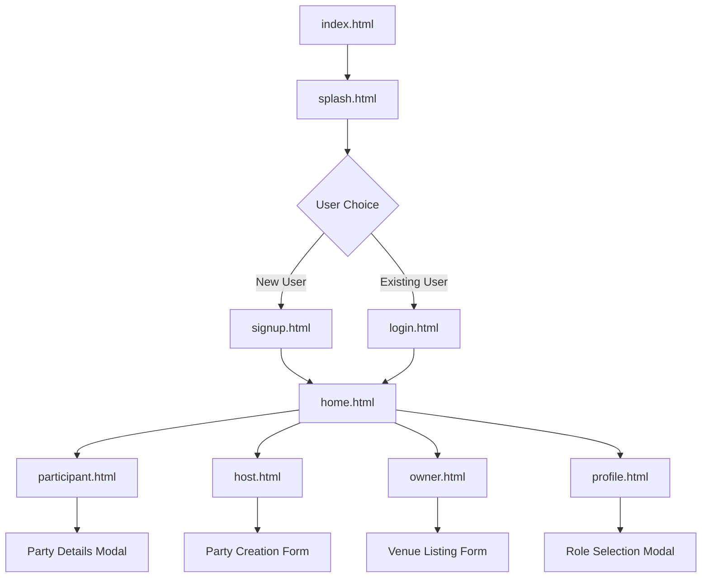

# PartyVerse - System Architecture Documentation

## 🏗️ Architecture Overview

PartyVerse is built as a client-side web application using modern frontend technologies. The architecture follows a modular, component-based approach with clear separation of concerns.

## 📁 Project Structure

```
PartyVerse/
├── 📄 Core Files
│   ├── index.html              # Application entry point
│   ├── splash.html             # Landing page
│   ├── styles.css              # Global stylesheet
│   └── shared.js               # Shared utilities and data
│
├── 🔐 Authentication
│   ├── login.html              # User login interface
│   └── signup.html             # User registration interface
│
├── 🏠 Main Application
│   ├── home.html               # Dashboard/home screen
│   ├── participant.html        # Party discovery interface
│   ├── host.html               # Party hosting interface
│   ├── owner.html              # Venue listing interface
│   └── profile.html            # User profile management
│
└── 📜 JavaScript Modules
    ├── participant.js          # Party discovery functionality
    ├── host.js                 # Party management features
    ├── owner.js                # Venue management features
    └── profile.js              # Profile management features
```

## 🔄 Application Flow



## 🧩 Component Architecture

### 1. Shared Components (`shared.js`)

**Purpose**: Common utilities, data management, and authentication functions.

**Key Functions**:
- `checkAuth()`: Authentication verification
- `getCurrentUser()`: Retrieve current user data
- `logout()`: User logout functionality
- `showNotification()`: Toast notification system
- `formatDate()`: Date formatting utilities

**Data Management**:
- Test user accounts
- Sample party data
- Sample venue data
- Session storage management

### 2. Authentication Layer

**Files**: `login.html`, `signup.html`

**Features**:
- Form validation
- Quick login buttons for testing
- Session management
- Automatic redirects

**Security**:
- Client-side validation
- Session storage for user data
- Password confirmation checks

### 3. Main Application Views

#### Home Dashboard (`home.html`)
- Welcome interface
- Feature overview
- Navigation to main sections
- User type indicator

#### Party Discovery (`participant.html` + `participant.js`)
- Interactive map display
- Search and filter functionality
- Party recommendation cards
- Modal party details

#### Party Hosting (`host.html` + `host.js`)
- Party creation form
- Hosted parties management
- CRUD operations for parties

#### Venue Management (`owner.html` + `owner.js`)
- Venue listing form
- Amenity selection
- Venue management interface

#### Profile Management (`profile.html` + `profile.js`)
- User information display
- Role switching functionality
- Account management options

## 🎨 Styling Architecture

### CSS Structure (`styles.css`)

**Design System**:
- **Color Palette**: Dark theme with purple accents
- **Typography**: Poppins font family
- **Spacing**: Consistent margin/padding system
- **Components**: Modular CSS classes

**Key Sections**:
1. **Reset & Base Styles**: Global resets and base styling
2. **Mobile Container**: Mobile-first responsive wrapper
3. **Authentication Screens**: Login/signup styling
4. **Main App Components**: Navigation, content areas
5. **Feature-Specific Styles**: Party cards, forms, modals
6. **Responsive Design**: Tablet and desktop optimizations

**CSS Architecture Patterns**:
- **BEM Methodology**: Block-Element-Modifier naming
- **Component-Based**: Reusable CSS components
- **Mobile-First**: Progressive enhancement approach
- **CSS Custom Properties**: Consistent theming

## 🔧 Data Architecture

### Client-Side Storage

**SessionStorage Usage**:
```javascript
// User authentication
sessionStorage.setItem('isLoggedIn', 'true');
sessionStorage.setItem('currentUser', JSON.stringify(user));

// Data persistence during session
hostedParties = []; // Array for created parties
listedVenues = [];  // Array for listed venues
```

### Sample Data Structure

**User Object**:
```javascript
{
  id: number,
  name: string,
  email: string,
  password: string,
  type: 'participant' | 'host' | 'owner' | 'admin',
  profilePicture: string (base64 or URL)
}
```

**Party Object**:
```javascript
{
  id: number,
  title: string,
  description: string,
  date: string (YYYY-MM-DD),
  time: string (HH:MM),
  location: string,
  type: 'birthday' | 'wedding' | 'corporate' | 'social',
  price: number,
  capacity: number,
  host: string,
  attendees: number
}
```

**Venue Object**:
```javascript
{
  id: number,
  name: string,
  description: string,
  address: string,
  capacity: number,
  pricePerHour: number,
  amenities: string[],
  owner: string
}
```

## 🔌 Integration Points

### External Dependencies

**CDN Resources**:
- **Font Awesome 6.0.0**: Icon library
- **Google Fonts**: Poppins typography

**No Backend Dependencies**:
- Pure client-side implementation
- No API calls or server communication
- Local storage for data persistence

### Future Integration Opportunities

**Backend Services**:
- REST API endpoints
- Database integration
- Real-time updates (WebSockets)
- File upload services

**Third-Party Services**:
- Payment processing (Stripe, PayPal)
- Maps integration (Google Maps, Mapbox)
- Push notifications
- Email services

## 🚀 Performance Considerations

### Optimization Strategies

**Loading Performance**:
- Minimal external dependencies
- Inline critical CSS
- Optimized image formats
- Efficient JavaScript execution

**Runtime Performance**:
- Event delegation for dynamic content
- Debounced search functionality
- Lazy loading for images
- Efficient DOM manipulation

**Memory Management**:
- Proper event listener cleanup
- Efficient data structures
- Minimal global variables

## 🔒 Security Architecture

### Current Security Measures

**Client-Side Security**:
- Input validation and sanitization
- XSS prevention through proper DOM manipulation
- Session-based authentication
- Form validation

**Security Limitations** (Client-Side Only):
- No server-side validation
- Credentials stored in plain text (demo purposes)
- No HTTPS enforcement
- No CSRF protection

### Production Security Requirements

**Backend Security**:
- Server-side validation
- Encrypted password storage
- JWT token authentication
- HTTPS enforcement
- CORS configuration

## 📱 Responsive Design Architecture

### Breakpoint Strategy

**Mobile-First Approach**:
- Base styles for mobile (320px+)
- Tablet optimizations (768px+)
- Desktop enhancements (1024px+)

**Layout Adaptations**:
- Flexible grid systems
- Responsive navigation
- Adaptive form layouts
- Scalable typography

## 🧪 Testing Architecture

### Current Testing Approach

**Manual Testing**:
- Cross-browser compatibility
- Device responsiveness
- User workflow validation
- Feature functionality testing

**Test Data**:
- Pre-configured user accounts
- Sample party and venue data
- Various user scenarios

### Future Testing Strategy

**Automated Testing**:
- Unit tests for JavaScript functions
- Integration tests for user workflows
- E2E testing with Playwright/Cypress
- Performance testing

## 🔄 State Management

### Current State Management

**Local State**:
- Component-level state management
- Session storage for persistence
- Global variables for shared data

**State Flow**:
1. User authentication state
2. Form data state
3. Dynamic content state (parties, venues)
4. UI state (modals, filters)

### Future State Management

**Advanced Patterns**:
- Centralized state management (Redux/Vuex)
- Reactive state updates
- Optimistic UI updates
- State persistence strategies

---

This architecture provides a solid foundation for the PartyVerse prototype while maintaining flexibility for future enhancements and production deployment.
